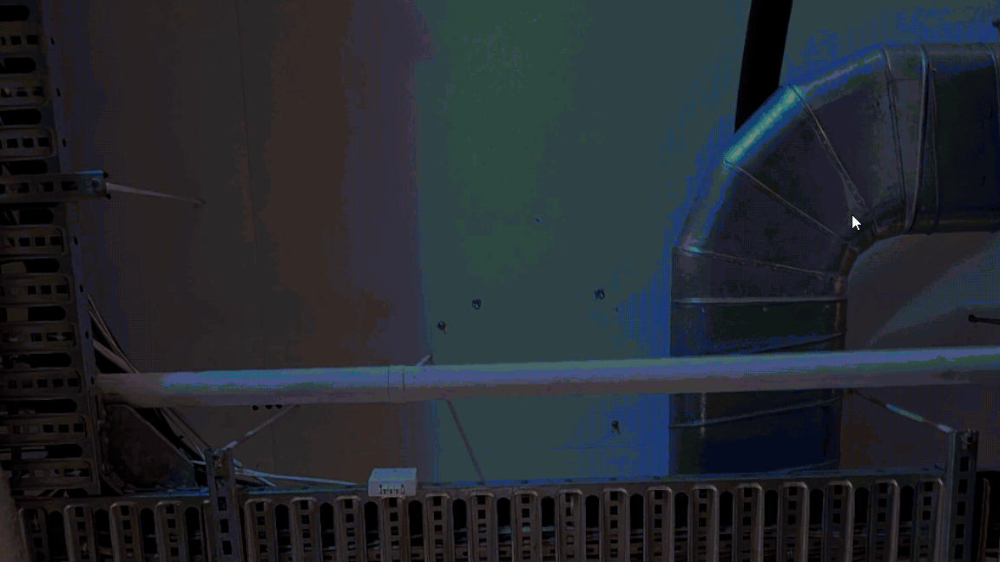

# Game-A-Week 2026: Week 1

| |  
|---|---|

> Game-A-Week is an intensive program in which participants will create 6 prototype games or works - one each week. The aims of Game-A-Week are multifaceted and center around the benefits of “sketching” - something not practiced as often in games as other arts. With your “sketches”, you’ll practice working on small scope ideas, experimenting in a low stakes and supportive environment, practice receiving feedback and help discover and develop your own taste as an artist. Drawing influence from game jams, Game-A-Week will prompt you with weekly thematic, aesthetic, or mechanical constraints (e.g. “time” or “black-and-white” or “one-button input”).

## Theme: Thinking Small

> Hello! This week is quite unique - instead of prompting you with something thematic, aesthetic, or mechanical, we’re instead focusing on something we’ve never done before. Thinking Small is about process. The process of making something small, while helping you unpack the impulse to make large works, and get a feeling for what is “enough”. It can be tough to imagine a super tiny work as a satisfying whole, especially when you’ve not done it before.

## Game: ???

For week 1 I created a small drawing game, where your creations come back as memories shortly after. Ideally built for a showcase/crowd setting, where the memory bank grows as different people interact, creating cross-play between individual experiences. As more drawings are saved, the time between memories decreases too, gradually causing a rush of creations to spring up. 

I chose to soundtrack it with a selection of songs from Mid-Air Thief/Bird's Eye Batang/Bird's Eye Thief, to match the colourful, sporadic nature of the game. Sounds from drawings and memories popping in and out create a second layer of chaotic sound underneath the music. Further, the interaction between what the player is hearing and what they are doing creates another level of play, as it can feel like one affects the other (though this is not the case). 

## Acknowledgements
- *SPap*, by **새눈도둑 Bird's Eye Thief**, from the album *[Flash](https://midairthief.bandcamp.com/album/flash)*
- *Open End*, by **새눈도둑 Bird's Eye Thief**, from the album *[Flash](https://midairthief.bandcamp.com/album/flash)*
- *Towards*, by **새눈바탕 Bird's Eye Batang**, from the album *[Flood Format](https://midairthief.bandcamp.com/album/flood-format)*
- *Are Your Wings Swept?*, by **새눈바탕 Bird's Eye Batang**, from the album *[Flood Format](https://midairthief.bandcamp.com/album/flood-format)*
* [Squigglevision](https://godotshaders.com/shader/squigglevision/) shader by tentabrobpy
* *Krank* sound effects by **[legoluft](http://www.legoluft.de/)**, [via OpenGameArt.org](https://opengameart.org/content/atmospheric-interaction-sound-pack)
* Thanks to 
  * Koder, Stella for hosting GAW
  * Ellie, for helping to get the Squigglevision shader working
  * Sabby Co-Op, for co-working space and support